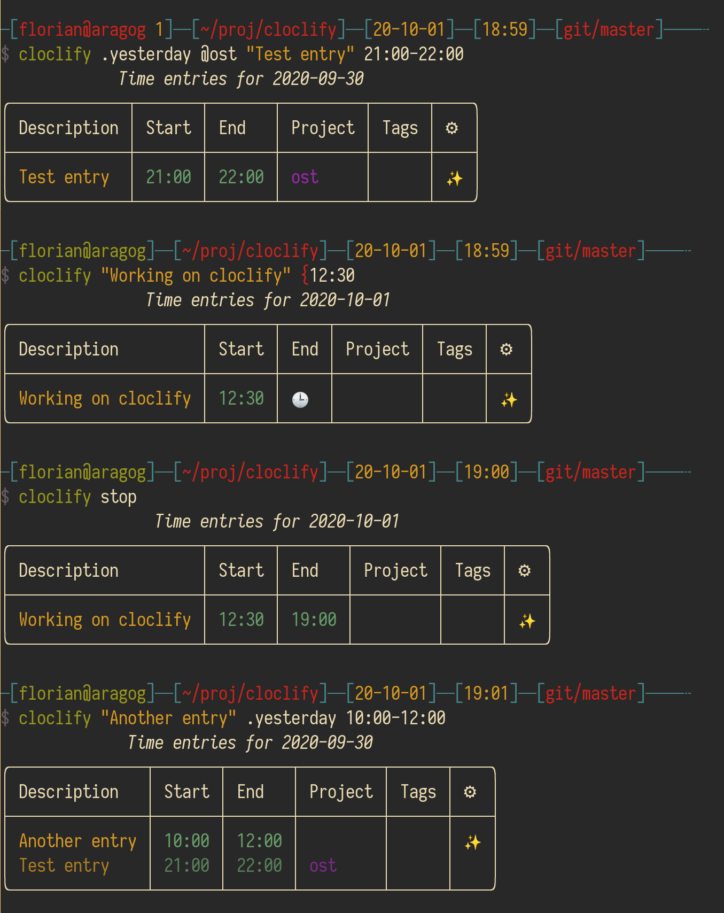

# cloclify

A CLI for [Clockify](https://clockify.me/), with colors and beautiful output.

## Getting Started

### Prerequisites

Optional but recommend [pipx](https://github.com/pypa/pipx).

### Installation

#### Using `pipx` (recommended)

One-line command: `pipx install git+https://github.com/The-Compiler/cloclify.git`

#### System-wide installation (not recommended)

1. `git clone https://github.com/The-Compiler/cloclify.git`
2. `cd cloclify`
3. `pip install .`

### Usage

#### Add 'CLOCKIFY_API_KEY' to environment

After installation, go to `~/.bashrc` or `~/.zshrc` and add the following line:

`export CLOCKIFY_API_KEY=your_key`

Restart terminal and issue `cloclify` to start using.

See `cloclify --help` for a description of the argument syntax.
